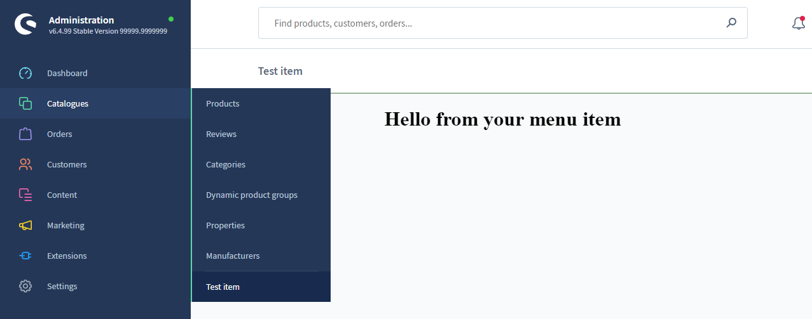

# Menu Item

### Add menu item
Add a new menu item to the Shopware admin menu. The content of the menu item module is determined by your `locationId`. 
A specific view or a set of actions can be triggered based on the `locationId`.

#### Usage:  
```ts
ui.menu.addMenuItem({
    label: 'Test item',
    locationId: 'your-location-id',
    displaySearchBar: true,
    parent: 'sw-catalogue',
})
```

#### Parameters
| Name                 | Required | Default        | Description                                                   |
| :------------------- | :------- | :------------- | :------------------------------------------------------------ |
| `label`              | true     |                | The label of the tab bar item                                 |
| `locationId`         | true     |                | The id for the content of the menu item module                |
| `displaySearchBar`   | false    | true           | Toggles the sw-page search bar on/off                         |
| `parent`             | false    | 'sw-extension' | Determines under which main menu entry your item is displayed |
| `position`           | false    | 110            | Determines the position of your menu item                     |

#### Example

```ts
// General commands
if (location.is(sw.location.MAIN_HIDDEN)) {
    // Add the menu item to the catalogue module
    ui.menu.addMenuItem({
        label: 'Test item',
        displaySearchBar: true,
        locationId: 'your-location-id',
        parent: 'sw-catalogue',
    });
}

// Render your custom view
if (location.is('your-location-id')) {
    document.body.innerHTML = '<h1 style="text-align: center">Hello from your menu item</h1>';
}
```