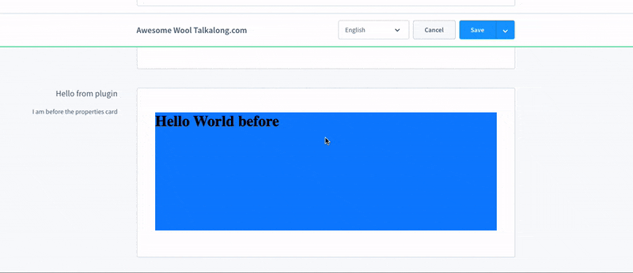

# Locations

Extensions can render custom views via iFrames. To support multiple views in different places every `location` of the iFrame gets a unique ID. These can be defined by the extension developer itself.

*Example:*  

A extension wants to render a custom iFrame in a card in the dashboard. The `location` of the iFrame has then a specific `locationId` like `sw-dashboard-example-app-dashboard-card`. The app can also render another iFrames which also get `locationId`s. In our example it is a iFrame in a custom modal: `example-app-example-modal-content`.

The extension want to render different views depending on the `location` of the iFrame. So the extension developer can render the correct view depending on the `locationId`:
```js
// Add the ui extensions when your extension is loaded in the hidden iFrame
if (location.is(location.MAIN_HIDDEN)) {
  ui.componentSection.add({
      component: 'card',
      positionId: 'sw-product-properties__before',
      props: {
          title: 'Hello from plugin',
          subtitle: 'I am before the properties card',
          /**
           *  The locationId:
           **/
          locationId: 'my-app-card-before-properties'
      }
  })
}

// Render the custom UI when the iFrame location matches your defined location
if (sw.location.is('my-app-card-before-properties')) {
    document.body.innerHTML = '<h1>I am the in the location "my-app-card-before-properties"</h1>';
}
```

## Base location
Every extension gets rendered in a hidden iFrame. In this iFrame the extension can execute different commands to extend
the administration and add custom locations to different extension points. To check if the script will be executed in this
location you can use the predefined constant:

```js
import { location } from '@shopware-ag/admin-extension-sdk';

if (location.is(location.MAIN_HIDDEN)) {
  // Do the stuff in the hidden iFrame
}
```

## Change height of location iFrame
The iFrame height is by default fixed. You can update the height with the location helper:
```js
location.updateHeight(750); // change iFrame height to 750px
```

If you use a parameter then the height will automatically be calculated so that your whole view gets rendered. In most cases
you don't want to update the height manually. To watch for height changes you can use the auto resizer. It updates the iFrame
height everytime the height of the view changes:
```js
// watch for height changes and update the iFrame
location.startAutoResizer();
```
